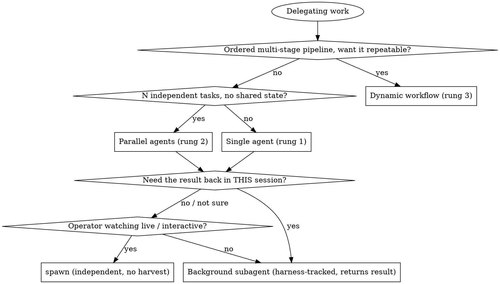

# The Orchestration Ladder — which primitive runs delegated work

Delegating work is not one decision. It's two, asked in order:

1. **How much structure does the work need?** → climb the ladder: single agent → parallel agents → dynamic workflow.
2. **Do you need the result back in *this* session?** → the spawn-vs-subagent axis, orthogonal to the ladder.

Most misfires come from answering neither and reaching for whatever primitive is top-of-mind. This skill makes both explicit.

## The ladder (lowest → highest structure)

| Rung | Primitive | Reach for it when | Don't when |
|---|---|---|---|
| 1 | **Single agent** | One coherent task with one owner. A worker with isolated context does it end-to-end. | The work is really N independent tasks (→ rung 2) or a repeatable multi-stage pipeline (→ rung 3). |
| 2 | **Parallel agents** | **2+ independent tasks with no shared state and no sequential dependency.** Different subsystems, different bugs, different research angles — investigated concurrently. | Tasks share state, must run in order, or one's output feeds the next (that's a workflow, not a fan-out). |
| 3 | **Dynamic workflow** | A **multi-step pipeline** where stages have order/dependencies, you want it **repeatable and harness-orchestrated**, and the result must return to the caller. Fan-out *inside* a stage is still rung 2 — a workflow is the deterministic scaffolding around the stages. | A one-off single task (rung 1) or a flat set of independent tasks (rung 2) — a workflow there is ceremony without payoff. |

**Climb only as far as the work demands.** Start at rung 1; move up only when the work genuinely has independence (→ 2) or ordered multi-stage structure worth making repeatable (→ 3). Over-orchestrating a simple task is the same failure as under-orchestrating a complex one — the cost just shows up later.

The parallel-agents rung has its own dedicated skill for *how* to do it well (crafting isolated context per agent, one agent per problem domain): **`dispatching-parallel-agents`**. This skill is the *when*; that skill is the *how*.

## The orthogonal axis — spawn vs. subagent (do you need the result back?)

At rungs 1–2 you still choose *how* the worker runs. This is a **separate** decision from the ladder, and conflating them is the most common orchestration mistake:

- **`spawn {name}`** = a **new, INDEPENDENT session** — an IDE tab (in an IDE) or Terminal.app window. Its own Remote-Control endpoint. The launching session does **NOT** control it and does **NOT** get its result back. To know it finished you'd poll files / git / a sentinel.
  - **Use for:** interactive sessions the operator drops into live (wallets, decks, symposiums), and judgment/research work the operator watches unfold (visible-spawn default — see `dispatching-parallel-agents` and the operator's preferences).

- **Background subagent (Agent tool) OR dynamic workflow** = runs **UNDER the current session**. The harness tracks it, **notifies you on completion, and returns its result directly**. (The Agent tool's `model` accepts specialist models too, so a background specialist subagent is possible.)
  - **Use for:** anything where **you must orchestrate and harvest the output yourself** — autonomous / overnight work reviewed later, fan-outs whose results you consolidate, any result that must come back inline.

### The tell you picked the wrong primitive

> If your plan needs a **file-sentinel plus a pgrep/monitor loop** to detect when a delegated session finished — **you wanted a subagent (or workflow), not a spawn.** The harness already gives you completion + result for free; rebuilding that around a `spawn` is a primitive mismatch, not a limitation of the model you spawned.

The exception the operator may set: when they're *present* and want to *watch* the work, a visible `spawn` is right even though you can't harvest it. When they're *away* and delegated work to *review the output later*, a background subagent whose result you surface is right. The operator's explicit call overrides the default.

## Decision flow

## Dynamic workflows — orientation

A **dynamic workflow** is the top rung: programmatic, multi-step orchestration the harness runs *under* your session and whose result returns to you. Reach for it when the work is a **pipeline** — stages with a defined order and dependencies (extract → analyze → cross-reference → write), especially one you'll run **more than once** and want deterministic rather than improvised each time.

Orientation notes:

- **Fan-out is a stage, not the shape.** A workflow can dispatch parallel agents *inside* a stage (rung 2 nested in rung 3), then gather them before the next stage. The workflow is the ordered scaffolding; the fan-out is one step of it.
- **Repeatability is the payoff.** If you'll do this exact pipeline once, a single coordinating session that dispatches subagents by hand is simpler. If it recurs (a weekly digest, an ingest pipeline, a multi-source research sweep), encoding it as a workflow makes it consistent and cheap to re-run.
- **The result comes back.** Like a subagent and unlike a `spawn`, a workflow reports completion and returns output to the caller — no sentinels.
- **Mind the plumbing.** Passing arguments *into* a workflow can be finicky (arguments may not thread cleanly through an external script path); when in doubt, prefer in-workflow constants or explicit parameters over relying on ambient arg-passing, and verify the workflow actually received what you sent.

## Anti-patterns

- **Fan-out with dependencies.** Parallel agents on tasks where B needs A's output → you'll serialize them by hand anyway. That's a workflow (or a single ordered agent), not a fan-out.
- **Spawn-then-poll.** Spawning an independent session and building a monitor loop to harvest it. Use a subagent/workflow — the harness harvests for free.
- **Workflow for a one-off single task.** Ceremony without payoff. Rung 1 with a subagent is enough.
- **Climbing for its own sake.** Reaching rung 3 because it feels thorough. Match the rung to the work's real structure; higher rungs cost setup and comprehension.
- **Ignoring the operator's presence.** Backgrounding work the operator wanted to watch, or spawning a visible session for work they wanted harvested silently overnight. The presence signal decides the axis.

## Relationship to other lenses

- **`dispatching-parallel-agents`** — the execution manual for rung 2 (how to craft isolated context, one agent per domain, when NOT to parallelize).
- **`leverage-points` / `team-archetypes`** — decide *where* to intervene and *with what posture*; this skill decides *with what orchestration mechanism* once you know the work.
- **`comprehension-debt`** — the more you orchestrate (especially rung 3, autonomous), the faster agent output outruns the operator's understanding. Climbing the ladder raises throughput *and* the debt; keep the gate honest.
