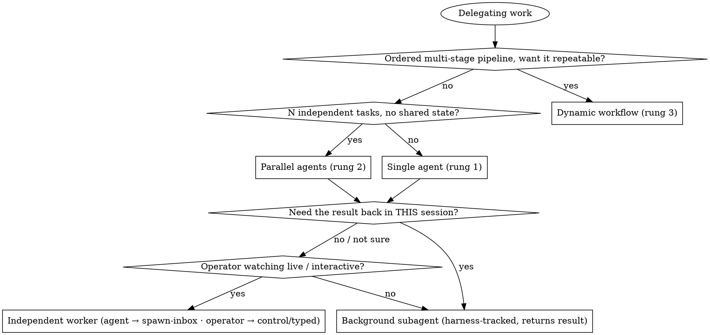

# The Orchestration Ladder — which primitive runs delegated work

Delegating work is not one decision. It's two, asked in order:

1. **How much structure does the work need?** → climb the ladder: single agent → parallel agents → dynamic workflow.
2. **Do you need the result back in *this* session?** → the spawn-vs-subagent axis, orthogonal to the ladder.

Most misfires come from answering neither and reaching for whatever primitive is top-of-mind. This skill makes both explicit.

## The ladder (lowest → highest structure)

| Rung | Primitive | Reach for it when | Don't when |
|---|---|---|---|
| 1 | **Single agent** | One coherent task with one owner. A worker with isolated context does it end-to-end. | The work is really N independent tasks (→ rung 2) or a repeatable multi-stage pipeline (→ rung 3). |
| 2 | **Parallel agents** | **2+ independent tasks with no shared state and no sequential dependency.** Different subsystems, different bugs, different research angles — investigated concurrently. | Tasks share state, must run in order, or one's output feeds the next (that's a workflow, not a fan-out). |
| 3 | **Dynamic workflow** | A **multi-step pipeline** where stages have order/dependencies, you want it **repeatable and harness-orchestrated**, and the result must return to the caller. Fan-out *inside* a stage is still rung 2 — a workflow is the deterministic scaffolding around the stages. | A one-off single task (rung 1) or a flat set of independent tasks (rung 2) — a workflow there is ceremony without payoff. |

**Climb only as far as the work demands.** Start at rung 1; move up only when the work genuinely has independence (→ 2) or ordered multi-stage structure worth making repeatable (→ 3). Over-orchestrating a simple task is the same failure as under-orchestrating a complex one — the cost just shows up later.

The parallel-agents rung has its own dedicated skill for *how* to do it well (crafting isolated context per agent, one agent per problem domain): **`dispatching-parallel-agents`**. This skill is the *when*; that skill is the *how*.

## The orthogonal axis — spawn vs. subagent (do you need the result back?)

At rungs 1–2 you still choose *how* the worker runs. This is a **separate** decision from the ladder, and conflating them is the most common orchestration mistake:

- **Independent interactive worker** = a **new session** in its own IDE tab / Terminal window, its own Remote-Control endpoint. The launcher does **NOT** control it and does **NOT** get its result back (you poll files / git / read its surface). *How you launch one depends on WHO launches it:*
  - **You're an agent (a Claude session):** you **cannot call `spawn`** — Claude's auto-mode classifier gates it as "launch an autonomous agent" (silent red-dot), and un-sandboxing does not help because the classifier gates it, not the sandbox. **Request it through the spawn-inbox:** write `~/.aios/spawn-inbox/<name>.json` = `{"name","task","model"|"tier"?}`, and whichever surface is running fulfils it natively — **AIOS Glass** inside the IDE (`vscode.createTerminal`) or the **AIOS App**, on every platform either ships to. The verbs are the same on both; there is no surface-specific dialect. **A surface is available when one is ALIVE**, which the inbox directory does not tell you — it persists forever once created. Check `~/.aios/surfaces/*.json` for a **running pid**; no live surface → hand it to the operator (control / paste), **never blind-call `spawn` and wait.** (Full contract: CLAUDE.md → Spawning Sessions.)
  - **The operator:** a surface's **"Spawn a session"** control, or types `spawn {name} "{task}"` in a terminal — which is also the whole path on a plain clone with no surface installed.
  - **Use an independent worker for:** interactive sessions the operator drops into live (wallets, decks, symposiums), and judgment/research work the operator watches unfold (visible-spawn default — see `dispatching-parallel-agents` and the operator's preferences).

- **Background subagent (Agent tool) OR dynamic workflow** = runs **UNDER the current session**. The harness tracks it, **notifies you on completion, and returns its result directly**. (The Agent tool's `model` accepts specialist models too, so a background specialist subagent is possible.)
  - **Use for:** anything where **you must orchestrate and harvest the output yourself** — autonomous / overnight work reviewed later, fan-outs whose results you consolidate, any result that must come back inline.

### The tell you picked the wrong primitive

> If your plan needs a **file-sentinel plus a pgrep/monitor loop** to detect when a delegated session finished — **you wanted a subagent (or workflow), not a spawn.** The harness already gives you completion + result for free; rebuilding that around a `spawn` is a primitive mismatch, not a limitation of the model you spawned.

The exception the operator may set: when they're *present* and want to *watch* the work, a visible independent worker (agent → spawn-inbox, operator → control/typed) is right even though you can't harvest it. When they're *away* and delegated work to *review the output later*, a background subagent whose result you surface is right. The operator's explicit call overrides the default.

## The command bus — how sessions actually reach each other

The spawn-inbox is not spawn-only: it is a **command bus with three verbs**, and it is how one session talks to another at all. Drop a `*.json` file in `~/.aios/spawn-inbox/` (filename arbitrary but distinct; the fulfilling surface consumes and deletes it):

- **spawn** (the default — no `action` key): `{"name":"designer","task":"design the hero","tier":"<rung>"}` — `task` is the optional first prompt; `"model":"<id>"` or `"tier":"<rung>"` route the worker by cognitive load (rungs: `MODEL-ROUTING.md`). A name already live is *revealed*, not duplicated.
- **send**: `{"action":"send","name":"designer","prompt":"ship it"}` — delivers a prompt into that live session's terminal. **One line, and mind the ceiling: a `prompt` over ~1024 bytes is NOT delivered as text.** Both fulfillers write it to `~/.aios/bus-payloads/<name>-<ts>.md` and type one pointer line instead — *"Read `<file>` and follow the full instructions inside it. That file IS the message… Do not act on this line alone."* **Receiving one: read the file, act on that, never on the pointer alone.** The 1024 figure selects the *mechanism*; it is **not** the true ceiling, which differs per surface and isn't always measurable from outside. Truncation is silent everywhere — an over-long prompt arrives looking complete, and a cut tail can drop exactly the constraint that mattered — so treat length as a protocol invariant: split a long brief into sequential sends, or write the payload file yourself and point at it.
- **kill**: `{"action":"kill","name":"designer"}` — closes its terminal (shell + claude + respawn loop).
- **resume**: `{"action":"resume","name":"designer","prompt":"the review came back"}` — reopens a **closed** named session with the context it already had. `spawn` gives you a fresh *something*; `resume` gives you back the same *someone*. The name resolves from the **transcripts** (`~/.claude/projects/*/*.jsonl`), never the session registry, which lists only running sessions and therefore cannot answer for the one case this verb is for; a renamed session resolves by its **last** `agent-name` record. **No transcript → dead letter naming the miss**, never a silent new spawn — opt in with `"fallback":"spawn"` (a *string*, not a boolean). **Already running → revealed and the prompt delivered**, exactly as `send` would, because resuming a live session would give one identity two processes.
- **An unknown `action` is REFUSED.** The four known verbs are **`spawn` · `send` · `kill` · `resume`**. Omitting `action` still means spawn (the `{name, task}` form is unchanged, and `{"action":"spawn", …}` is accepted written out), but a verb that is written and misspelled is dead-lettered naming what was written rather than degrading to spawn — which used to be harmless and stopped being so the moment `resume` made the outcomes differ. Case and surrounding whitespace are not significant, so a refusal means an unknown verb rather than a formatting slip. The fulfiller stamps `~/.aios/spawn-inbox/README.md` with `aios-spawn-inbox: contract N` — **3** for this verb set; a fulfiller on **2** handed a `resume` spawns a duplicate. (Grep the stamp text, not `INBOX_CONTRACT`, which is a source symbol in the App and Glass repos.)

**Addressing — the registry is the only truth.** Live sessions and their real names come from `~/.claude/sessions/*.json` (each: `name` · `pid` · `status` · `sessionId` · `cwd`). **Never `pgrep`, never a terminal tab title.** A *resumed* session keeps whatever its tab was called, so matching by process or tab name silently fails — it makes a live peer look dead, and the usual outcome is wrongly declaring a session closed. A surface resolves the target by **pid → process ancestry**, which is why messaging a long-lived coordinator works.

**Replying to whoever requested you.** A spawned worker answers its coordinator with `send` to the coordinator's registry name; the reply lands there as a new prompt. That closes the loop — real multi-turn conversation between sessions, no polling.

**Failure modes worth knowing** (each cost a real bug):

- Keep `prompt` on **one line** — multi-line text is typed into a terminal as multiple Enters.
- The request file vanishing means a surface **picked it up**, not that the work succeeded. To verify what a session actually did, read its transcript: `~/.claude/projects/*/<sessionId>.jsonl` (`sessionId` from its registry file) — status alone won't tell you.
- `send`/`kill` reach terminals belonging to the surface instance that consumed the request; with several IDE windows or panes open, whichever wins the race acts.
- Malformed or name-less requests are ignored (logged to the surface's own output channel or log) — a silent no-op, so check there if nothing happens.

The always-current reference lives in the inbox itself: **`~/.aios/spawn-inbox/README.md`**, written by whichever surface boots (the component that implements the dispatch is the one that documents it, so it can't drift). **Do not read the inbox directory as proof a bus exists** — it persists forever once created. A bus exists only while some `~/.aios/surfaces/*.json` names a **running pid**; with none live (a plain clone with no surface, or a surface the operator closed) there is no watcher, and a request written there is never picked up and never dead-lettered. Hand the spawn to the operator instead.

## Choosing the model for the worker (Calibrate-Don't-Choose)

Every primitive lets you pick the worker's model — a third decision, orthogonal to the ladder and the axis. Match it to the task's **cognitive load**: mechanical / deterministic work → the cheaper, faster tier; real reasoning, verification, synthesis → frontier. Default is to inherit the session model; change it deliberately, not reflexively.

| Primitive | How to set the model |
|---|---|
| **Subagent** (Agent tool) | `model` param (`opus` / `sonnet` / `haiku` / `fable`); `subagent_type` for a specialist. |
| **Dynamic workflow** (`agent()`) | `agent(prompt, {model, effort})` **per stage** — cheap model + low `effort` for mechanical stages (grep, transform, sweep); frontier + high/`max` effort for the verify / judge / synthesis stages. Mixing tiers within one workflow is the norm, not the exception. |
| **Spawn** (via the spawn-inbox) | `"model":"<id>"` **or** `"tier":"<rung>"` in the request JSON → the fulfilling surface passes `--model` / `--tier` to the worker. (Operator-typed: `spawn --model <id>` / `spawn --tier <rung>`.) |

**The rung names, the rung→model table, and how to verify an id resolves live in [`MODEL-ROUTING.md`](../../../MODEL-ROUTING.md) — not here.** This skill owns *which primitive* and *where the model goes* for each one; it deliberately does not name the rungs, because a second copy of that vocabulary is a second implementation of a fact that churns. (It used to name them, and went a version stale: it still offered a two-rung choice after the ladder had grown to four. A doc that does not restate a list cannot fall behind it.)

One lens across all three: *the model is a spend↔quality dial on each unit of delegated work.* Cheap where the work is mechanical, frontier where it's judgment — this is `Calibrate Don't Choose` (operating principles) applied to delegation. Don't pay frontier rates for a file sweep; don't cheap out on a synthesis or a verify pass.

## Scoping a worker's tools — the allowlist is not self-sufficient

Two levers, and they are not interchangeable. **`spawn --profile <name>`** scopes which **MCP servers** a worker loads — that is about blast radius (a file sweep should not hold live Gmail/Drive credentials) and about churn, since a server disconnecting mid-session invalidates the whole prompt prefix. **`--allowedTools`** on a headless `claude -p` scopes which **built-in tools** may run — and it is the one with a precondition.

> ⚠️ **`--allowedTools` alone does not hold.** Measured on a machine with `permissions.defaultMode: "auto"` in `settings.json`: a `claude -p` passing an allowlist naming a nonexistent tool, plus `--strict-mcp-config`, still performed `Bash` and `Write` calls — no error, no prompt, `permission_denials: []`. **A machine-level auto mode silently outranks the flag.** Pass `--permission-mode default` (or `plan`) beside it and the same call is blocked.
>
> This is the vendor's own position arriving from the other side: auto mode is a convenience feature backed by a best-effort classifier, **not a security boundary** — so it is not only what auto mode fails to *stop*, it is what auto mode will happily *allow* over an explicit allowlist.

Three shapes that look like the fix and are not: `--allowedTools ""` is swallowed (the flag is variadic and eats a prompt that follows it, so put the prompt **first**) · `--permission-mode manual` does **not** block · `--disallowedTools` is a denylist, so `Write`, `Edit` and `Agent` survive it.

**And you cannot verify any of this by asking the worker what tools it has.** Under a restrictive allowlist it still lists `Bash` and `Write` — it is describing its *schema*, not its permissions. **Only an absent side effect is evidence:** did a file appear, did the command run. `tests/headless-allowlist.test.sh` is that check; it skips loudly rather than passing where no `claude` binary exists.

Matters most when a delegated prompt carries text from **outside** the vault — a fetched page, an email body, a transcript. A published RCE against Claude Code came from a *"summarise this website"* request.

## Decision flow

## Dynamic workflows — orientation

A **dynamic workflow** is the top rung: programmatic, multi-step orchestration the harness runs *under* your session and whose result returns to you. Reach for it when the work is a **pipeline** — stages with a defined order and dependencies (extract → analyze → cross-reference → write), especially one you'll run **more than once** and want deterministic rather than improvised each time.

Orientation notes:

- **Fan-out is a stage, not the shape.** A workflow can dispatch parallel agents *inside* a stage (rung 2 nested in rung 3), then gather them before the next stage. The workflow is the ordered scaffolding; the fan-out is one step of it.
- **Repeatability is the payoff.** If you'll do this exact pipeline once, a single coordinating session that dispatches subagents by hand is simpler. If it recurs (a weekly digest, an ingest pipeline, a multi-source research sweep), encoding it as a workflow makes it consistent and cheap to re-run.
- **The result comes back.** Like a subagent and unlike a `spawn`, a workflow reports completion and returns output to the caller — no sentinels.
- **Mind the plumbing.** Passing arguments *into* a workflow can be finicky (arguments may not thread cleanly through an external script path); when in doubt, prefer in-workflow constants or explicit parameters over relying on ambient arg-passing, and verify the workflow actually received what you sent.

## Anti-patterns

- **Fan-out with dependencies.** Parallel agents on tasks where B needs A's output → you'll serialize them by hand anyway. That's a workflow (or a single ordered agent), not a fan-out.
- **Spawn-then-poll.** Spawning an independent session and building a monitor loop to harvest it. Use a subagent/workflow — the harness harvests for free.
- **Agent calling `spawn` directly.** An agent that runs `spawn <name>` hits Claude's auto-mode classifier gate (silent red-dot "tool use rejected") — and even un-sandboxed, the osascript palette-drive leaks/drops keystrokes. Agents **request via the spawn-inbox** (`~/.aios/spawn-inbox/<name>.json`) or hand the spawn to the operator; blind-calling `spawn` and waiting for a terminal is the silent-failure trap that hyperfrustrated operators.
- **Reading the inbox directory as "a surface will fulfil this."** It persists forever once created, so an operator who quit their surface has the directory and no watcher — the request is never picked up *and never dead-lettered*, so nothing surfaces the miss. Availability is a **live pid** in `~/.aios/surfaces/*.json`, never a directory that exists.
- **Assuming one surface.** Glass and the App are two independent implementations of one protocol, so "it works here" is evidence about one of them. Write and reason surface-neutrally; a fix present in one and absent in the other is the expected shape of the bug.
- **Workflow for a one-off single task.** Ceremony without payoff. Rung 1 with a subagent is enough.
- **Climbing for its own sake.** Reaching rung 3 because it feels thorough. Match the rung to the work's real structure; higher rungs cost setup and comprehension.
- **Ignoring the operator's presence.** Backgrounding work the operator wanted to watch, or spawning a visible session for work they wanted harvested silently overnight. The presence signal decides the axis.

## Relationship to other lenses

- **`dispatching-parallel-agents`** — the execution manual for rung 2 (how to craft isolated context, one agent per domain, when NOT to parallelize).
- **`leverage-points` / `team-archetypes`** — decide *where* to intervene and *with what posture*; this skill decides *with what orchestration mechanism* once you know the work.
- **`comprehension-debt`** — the more you orchestrate (especially rung 3, autonomous), the faster agent output outruns the operator's understanding. Climbing the ladder raises throughput *and* the debt; keep the gate honest.
